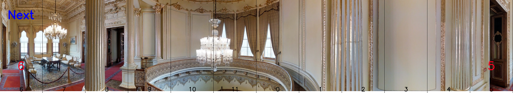
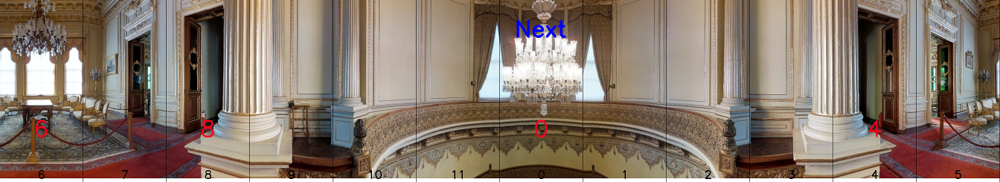
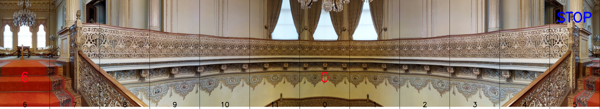

# Matterport3D Navigation Dataset






# 1. Dataset
```python
# dataset/base_dataset.py
train_dataset = BaseDataset(
    config=dataset_cfg.Dataset, # tools/cfgs/datasets/datasets.yaml
    split=args.split # 'train'
)
```

## 2. Data Examples
```shell
# for SOON Dataset
['<image>Question: What are the attributes of the target object? Answer: This is a brand new white, rectangular wooden table.<|endofchunk|></s>',
 '<image>Question: What is the relationship between the target object and other objects in the room? Answer: It is above a few chairs, under a pot of flowers.<|endofchunk|></s>']

# for Fine-grained Dataset
['<image>Question: What is the next step I should take based on the instruction: go through the bedroom? Answer: You should go in direction 1.<|endofchunk|></s>',
 '<image>Question: What is the next step I should take based on the instruction: and stop in front of the spa bath? Answer: You should go in direction 3.<|endofchunk|></s>']

```

## TODO Prompt
```python
# dataset/preprocess_data.py
promptQAs = {
    'soon_qa': [
        "What are the attributes of the target object?",                                     # 0
        "What is the relationship between the target object and other objects in the room?", # 1
        "Which room or area is the target object in?",                                       # 2
        "What is the relationship between the target room and other neighboring rooms?",     # 3
        "What is the navigation instruction for the current scene?",                         # 4 full instruction
        "What is the target object of navigation?",                                          # 5 target object
    ],
    'image2text': [
        "What direction should I turn after reaching <Image>?",
        "What should I do after reaching <Image>?",
        "What is the next step after reaching <Image>?",
    ],
    'image+text': [
        "Based on the image <Image> and the instruction <Instruction>, what is the next step I should take?",
        "Using the image <Image> and the instruction <Instruction>, what is the next landmark I should look for?",
        "Given the instruction <Instruction>, which direction should I turn based on the image <Image>?",
        "What is the next direction to follow after reaching the location shown in <Image>, given the instruction <Instruction>?",
        "From the current image, which direction should I turn based on the instruction <Instruction>?",
        "Which direction should I turn based on the instruction <Instruction>?", # 5
        "What is the next step I should take based on the instruction: <Instruction>?", # 6
    ],
    'image+viewpoint': [
        "From the current image <Image>, what should I do to reach <Direction-{}>?",
        "After reaching the current image <Image>, what should I do to get to <Direction-{}>?",
        "What is the next step after reaching <Image> and facing <Direction-{}>?",
    ],
    # TODO image-text format, from https://github.com/mlfoundations/open_flamingo
    "open_flamingo": [
        "<image>{text}<|endofchunk|>{tokenizer_eos_token}",

        # <image_0>..<image_11>{text}<|endofchunk|>{tokenizer_eos_token}
        "".join(["<image_{}>".format(i) for i in range(12)]) + "{text}<|endofchunk|>{tokenizer_eos_token}"
    ],
    "answer+viewpoint": [
        "You should walk towards <Direction-{ViewID}>.",
        "You should head towards <Direction-{ViewID}>.",
        "You should go in direction {ViewID}.", # 2
        "You should {STOP}.", # 3
    ],
}

```
