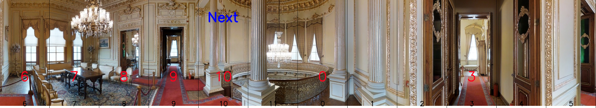

# LLaVa-Instruct-SubSet
```shell
# install data to build/LLaVa/
wget https://huggingface.co/datasets/LinZhao/LLaVA-Instruct-21K-COCO-SubSet/resolve/main/train.json
wget https://huggingface.co/datasets/LinZhao/LLaVA-Instruct-21K-COCO-SubSet/resolve/main/val_seen.json
wget https://huggingface.co/datasets/LinZhao/LLaVA-Instruct-21K-COCO-SubSet/resolve/main/val_unseen.json
wget https://huggingface.co/datasets/LinZhao/LLaVA-Instruct-21K-COCO-SubSet/resolve/main/test.json
```


# Matterport3D Navigation Dataset

## Instruction Generation on Matterport3D
- script: use checkpoint_10.pt to generate instructions.
```shell
torchrun --nnodes=1 --nproc_per_node=8 generate_net.py --cfg_file tools/cfgs/datasets/s2_imgdatasets.yaml --vision_encoder_path "ViT-L-14" --tokenizer_path /mnt/lustre/zhaolin/vln/llm/models --cross_attn_every_n_layers 8 --run_name Train3 --train_with_generate True --workers 4 --generate_nums 20000 --resume_from_checkpoint /mnt/lustre/zhaolin/vln/nav/vl_nav_output/Train3/checkpoint_10.pt --generate_split val_unseen
```
- question template:
```shell
    "_gt_full_text": "Please help me navigate inside the building. 
    I will provide 12 images of the environment from different direction angles.
    Environment:<image>-direction 0;<image>-direction 1;<image>-direction 2;<image>-direction 3;<image>-direction 4;
    <image>-direction 5;<image>-direction 6;<image>-direction 7;<image>-direction 8;<image>-direction 9;
    <image>-direction 10;<image>-direction 11;.
    Question:how to get to direction 0?Answer:<|endofchunk|></s>",
    "generate_answer_text": "walk through the doorway straight ahead<|endofchunk|>",
    "_gt_question_text": "Question:how to get to direction 0?"
```
- generate data:
```shell
build/data/mp3d_12view_instructions_checkpoint_10.json
```
- visualize image and instructions
```shell

```


## Dataset
### 1. select dataset: [SOON](https://scenario-oriented-object-navigation.github.io/), [Fine-grained R2R](https://github.com/YicongHong/Fine-Grained-R2R), [REVIERE(TODO)](https://yuankaiqi.github.io/REVERIE_Challenge/dataset.html)
```shell
# tools/cfgs/datasets/imgdatasets.yaml:
  # Specify the dataset name to use
  SOURCE: ['SOON','FR2R'] 
```

### 2. SOON question answer:
```shell
data/soon_qa.json:
  SOON train set question-answer pairs
```


## Training script
```shell
# S2
## 1. srun --partition=OpenDialogLab_S2 --gres=gpu:8 --ntasks-per-node=1 -n1 -c 64 --mem-per-cpu=40G --pty bash
## 2. srun --partition=OpenDialogLab_S2 --gres=gpu:1 --ntasks-per-node=1 -n1 -c 32 --mem-per-cpu=40G --pty bash
## 3. torchrun --nnodes=1 --nproc_per_node=8 train_net.py --tokenizer_path /mnt/lustre/zhaolin/vln/llm/models --cfg_file tools/cfgs/datasets/s2_imgdatasets.yaml --batch_size 2 --vision_encoder_path "ViT-B-16" --cross_attn_every_n_layers 8 --warmup_steps 1200 --num_epochs 20 --workers=4 --logging_steps 100
## 4. torchrun --nnodes=1 --nproc_per_node=8 train_net.py --tokenizer_path /mnt/lustre/zhaolin/vln/llm/models --cfg_file tools/cfgs/datasets/s2_imgdatasets.yaml --batch_size 2 --vision_encoder_path "ViT-B-16" --cross_attn_every_n_layers 8 --warmup_steps 1200 --num_epochs 20 --workers=4 --logging_steps 1000
## 5. generate:
  torchrun --nnodes=1 --nproc_per_node=1 --master_port 33534 eval_net.py --text_generate --split val_seen --tokenizer_path /mnt/lustre/zhaolin/vln/llm/models --cfg_file tools/cfgs/datasets/s2_imgdatasets.yaml --batch_size 2 --vision_encoder_path "ViT-L-14" --cross_attn_every_n_layers 8 --run_name Train1 --warmup_steps 1200 --num_epochs 40 --workers=0 --logging_steps 1000 --learning_rate 3e-5 --weight_decay 0.05  --text_generate --split val_seen --generate_start_index 6000 --generate_nums 200
torchrun --nnodes=1 --nproc_per_node=8 train_net.py \ 
  --tokenizer_path /mnt/lustre/zhaolin/vln/llm/models \ # LLaMa-7B
  --cfg_file tools/cfgs/datasets/s2_imgdatasets.yaml \
  --batch_size 2 \
  --vision_encoder_path "ViT-B-16" \
  --cross_attn_every_n_layers 8 \
  --warmup_steps 1200 \
  --num_epochs 20 \
  --workers=4 \
  --logging_steps 100
  
torchrun --nnodes=1 --nproc_per_node=2 train_net.py \
  --tokenizer_path /mnt/lustre/zhaolin/vln/llm/models \
  --cfg_file tools/cfgs/datasets/s2_imgdatasets.yaml \
  --batch_size 2

## 4. TEST
  - time cost: (single GPU, batch size 1)
    --vision_encoder_path "ViT-B-16"
      CLIP-Encoder: 12 image views, ~14.80 ms
      Model(CLIP+LLaMa-7B) Forward: ~61.54 ms
    --vision_encoder_path "ViT-L-14"
      CLIP-Encoder: 12 image views, ~45.13 ms
      Model(CLIP+LLaMa-7B) Forward: ~88.55 ms

## 5. --cross_attn_every_n_layers 4/8
__Comment: How often to apply cross attention after transformer layer. 
  raw LLaMa-7B: 32 LlamaDecoderLayers
(1) --cross_attn_every_n_layers 4: 32//4=8 GatedCrossAttentionBlocks
(2) --cross_attn_every_n_layers 8: 32//8=4 GatedCrossAttentionBlocks
https://github.com/mlfoundations/open_flamingo/issues/129#issuecomment-1492884192 
```

----





# 1. Dataset
```python
# dataset/base_dataset.py
train_dataset = BaseDataset(
    config=dataset_cfg.Dataset, # tools/cfgs/datasets/datasets.yaml
    split=args.split # 'train'
)
```

## 2. Data Examples


## TODO Prompt
